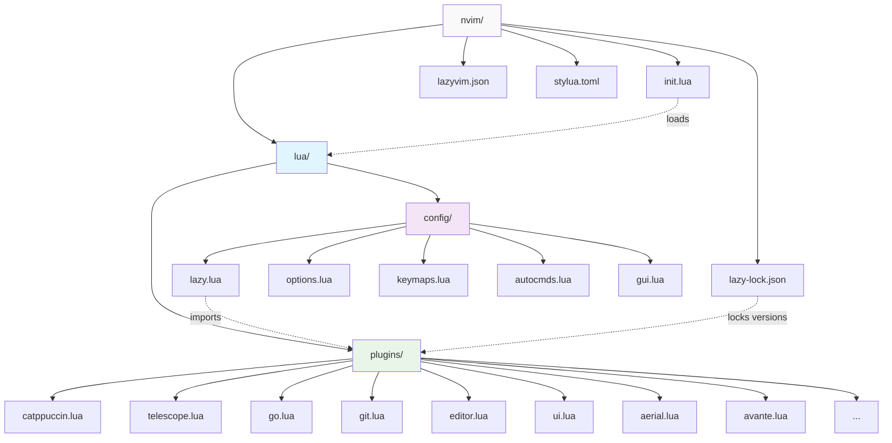
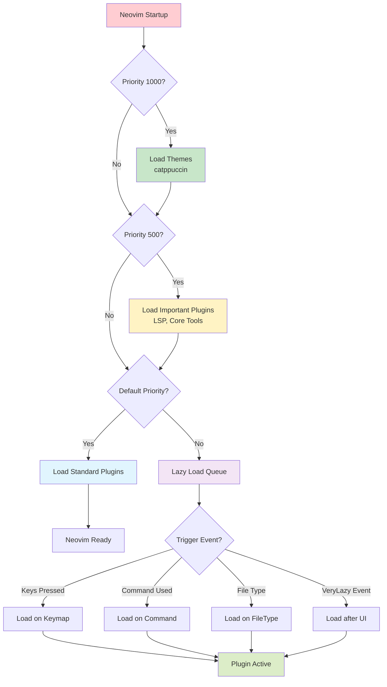
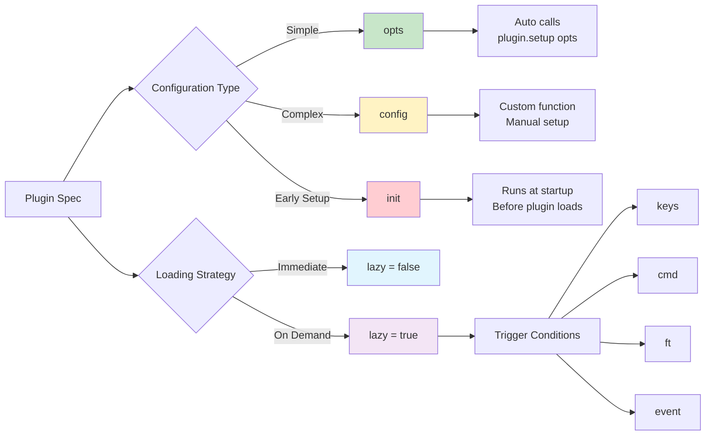
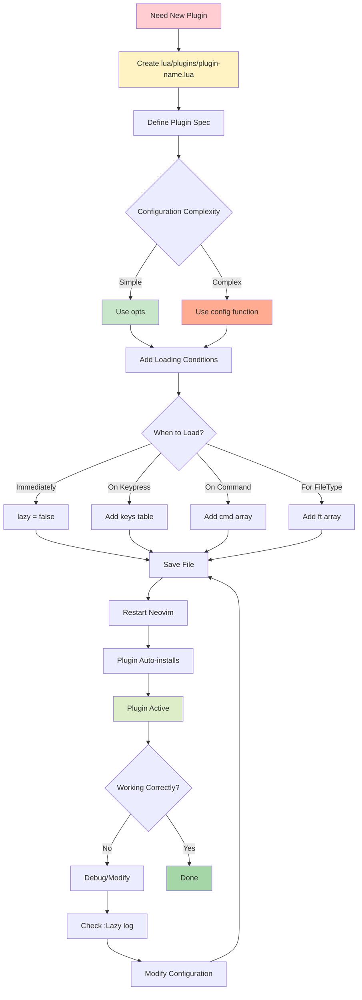

# LazyVim Architecture Guide

## 📊 Viewing Mermaid Diagrams

This document contains interactive Mermaid diagrams. To view them properly:

### **In Neovim** (Recommended):
- **Primary**: `<leader>mp` - Toggle markdown preview with mermaid support (markdown-preview.nvim)
- **Alternative**: `<leader>mm` - Open markdown preview in browser
- **Stop Preview**: `<leader>ms` - Stop markdown preview
- **Advanced**: `<leader>mP` - Peek preview (requires Deno installation)

### **External Tools**:
- **GitHub**: View this file on GitHub for native mermaid rendering
- **Online**: Copy diagrams to [mermaid.live](https://mermaid.live) for interactive editing
- **VSCode**: Use Mermaid Preview extension

### **Plugin Details**:
- **markdown-preview.nvim**: Reliable browser-based preview with excellent mermaid support (primary)
- **peek.nvim**: Modern Deno-based previewer (requires `deno` installation - optional)
- Both plugins are configured in `lua/plugins/mermaid.lua`

### **Installation Requirements**:
- **Basic Mermaid Support**: No additional dependencies (uses markdown-preview.nvim)
- **Advanced Features**: Install Deno with `./setup.sh` (option 3) or `brew install deno`

---

## Overview

This document explains the architecture and organization of your LazyVim-based Neovim configuration. Understanding this structure will help you customize, maintain, and troubleshoot your setup effectively.

## Core Concepts

### 1. Lazy Loading

**What it is**: Plugins are loaded only when needed (on specific events, commands, or filetypes) rather than at startup.

**Benefits**:
- Faster startup time
- Reduced memory usage
- Better performance

**How it works**: LazyVim automatically determines when to load plugins based on:
- `lazy = true/false` - Controls if plugin should be lazy loaded
- `event` - Load on specific Neovim events (e.g., "BufReadPost", "VeryLazy")
- `cmd` - Load when specific commands are executed
- `ft` - Load for specific filetypes
- `keys` - Load when specific keybindings are pressed

### 2. Plugin Specification

**Plugin Spec Structure**:
```lua
{
  "author/plugin-name",           -- Plugin repository
  lazy = true,                    -- Enable lazy loading (default in LazyVim)
  event = "VeryLazy",            -- When to load
  dependencies = { "dep1", "dep2" }, -- Plugin dependencies
  opts = { option = value },      -- Plugin options (calls setup() automatically)
  config = function() end,        -- Custom configuration function
  init = function() end,          -- Always runs at startup (before plugin loads)
  keys = { ... },                -- Keybindings that trigger plugin loading
  cmd = { "Command1", "Command2" }, -- Commands that trigger loading
  ft = { "go", "lua" },          -- Filetypes that trigger loading
  priority = 1000,               -- Load order (higher = earlier)
}
```

### 3. Configuration Types

#### `opts` vs `config` vs `init`

**`opts`**: 
- Simplest way to configure plugins
- Automatically calls `require("plugin").setup(opts)`
- Use for basic plugin configuration

```lua
opts = {
  theme = "catppuccin",
  enable_feature = true,
}
```

**`config`**:
- Custom configuration function
- Runs after plugin is loaded
- Use for complex setup or when you need custom logic

```lua
config = function()
  local plugin = require("plugin")
  plugin.setup({
    custom_option = "value"
  })
  -- Additional custom setup
  vim.keymap.set("n", "<leader>x", plugin.some_function)
end
```

**`init`**:
- Runs immediately at startup (before plugin loads)
- Use for setting vim options or early configuration
- Always executes regardless of lazy loading

```lua
init = function()
  vim.g.plugin_variable = "value"
  vim.opt.option = true
end
```

## Directory Structure



### File Structure Details

```
nvim/
├── init.lua                    # Entry point - loads LazyVim
├── lua/
│   ├── config/                 # Core configuration
│   │   ├── lazy.lua           # Plugin manager setup + language extras
│   │   ├── options.lua        # Vim options (set commands)
│   │   ├── keymaps.lua        # Global keybindings
│   │   ├── autocmds.lua       # Autocommands
│   │   └── gui.lua            # GUI-specific settings
│   └── plugins/               # Plugin definitions
│       ├── catppuccin.lua     # Theme configuration
│       ├── telescope.lua      # Fuzzy finder + search
│       ├── go.lua             # Go development stack
│       ├── git.lua            # Git/GitHub integration
│       ├── editor.lua         # Editor enhancements
│       ├── ui.lua             # UI/UX improvements
│       ├── aerial.lua         # Code outline navigation
│       ├── avante.lua         # AI assistant integration
│       └── ...                # Additional plugin configs
├── lazy-lock.json             # Plugin version lockfile
├── lazyvim.json               # LazyVim settings
└── stylua.toml               # Lua code formatting
```

### `/lua/config/` Directory

**Purpose**: Core Neovim configuration that affects the entire editor

**Files**:
- `lazy.lua`: Plugin manager configuration and language extras imports
- `options.lua`: Vim settings (`set` commands like `set number`, `set tabstop`)
- `keymaps.lua`: Global keybindings not tied to specific plugins
- `autocmds.lua`: Autocommands (automatic actions on events)
- `gui.lua`: GUI-specific settings (font, window size, etc.)

### `/lua/plugins/` Directory

**Purpose**: Individual plugin configurations

**Organization Strategy**:
- **By Functionality**: Group related plugins (git.lua, go.lua, ui.lua)
- **By Plugin**: One file per major plugin (telescope.lua, catppuccin.lua)
- **By Language**: Language-specific tools (go.lua for Go development)

## LazyVim Integration

### Language Extras

**What they are**: Pre-configured plugin bundles for specific languages

**Your Configuration** (`config/lazy.lua`):
```lua
{ import = "lazyvim.plugins.extras.lang.go" },        -- Go development
{ import = "lazyvim.plugins.extras.lang.typescript" }, -- TypeScript/JavaScript
{ import = "lazyvim.plugins.extras.lang.python" },     -- Python support
{ import = "lazyvim.plugins.extras.lang.markdown" },   -- Markdown support
{ import = "lazyvim.plugins.extras.test.core" },       -- Testing framework
{ import = "lazyvim.plugins.extras.dap.core" },        -- Debug adapter protocol
```

**What each provides**:
- **Go**: gopls LSP, go debugging, test runner, formatting
- **TypeScript**: tsserver, eslint, prettier, node debugging
- **Python**: pyright LSP, python debugging, formatting
- **Markdown**: enhanced markdown support, preview
- **Test Core**: neotest framework for running tests
- **DAP Core**: debug adapter protocol for debugging

### Plugin Loading Order



**Priority System** (higher number = loads earlier):
1. `priority = 1000` - Themes and critical plugins
2. `priority = 500` - Important plugins
3. Default priority - Most plugins
4. `lazy = true` - Load on demand

**Example from your config**:
```lua
{
  "catppuccin/nvim",
  priority = 1000,  -- Load first (theme needs to be available early)
  lazy = false,     -- Don't lazy load
}
```

## Custom Plugin Organization

### Your Plugin Categories

#### **Theme & UI** (`catppuccin.lua`, `ui.lua`)
- Color scheme configuration
- Status line, notifications, command line enhancements
- Visual improvements

#### **Language Development** (`go.lua`, `lang/`)
- Language servers (LSP)
- Debugging configurations (DAP)
- Language-specific tools and utilities

#### **Git Workflow** (`git.lua`)
- Git integration (lazygit, gitsigns)
- GitHub tools (octo.nvim, gh.nvim)
- Git utilities (blame, permalinks)

#### **Editor Enhancement** (`editor.lua`)
- Text editing improvements
- Window management
- Navigation tools

#### **Search & Navigation** (`telescope.lua`, `aerial.lua`)
- Fuzzy finding
- Code navigation
- Symbol browsing

### Plugin Configuration Patterns



#### **Simple Configuration** (uses `opts`):
```lua
{
  "plugin/name",
  opts = {
    option1 = "value",
    option2 = true,
  }
}
```

#### **Complex Configuration** (uses `config`):
```lua
{
  "plugin/name",
  config = function()
    require("plugin").setup({
      -- configuration
    })
    -- additional setup
  end
}
```

#### **Lazy Loading with Keys**:
```lua
{
  "plugin/name",
  keys = {
    { "<leader>x", "<cmd>PluginCommand<cr>", desc = "Description" },
  },
  config = function()
    -- Plugin loads only when <leader>x is pressed
  end
}
```

## Key Architecture Differences from NvChad

### NvChad Structure
```
nvim/
├── init.lua
├── lua/
│   ├── core/           # Framework core
│   ├── plugins/        # Default plugins
│   └── custom/         # User customizations
│       ├── chadrc.lua  # Main config override
│       ├── plugins.lua # Plugin definitions
│       └── mappings.lua # Custom keybindings
```

### LazyVim Structure
```
nvim/
├── init.lua
├── lua/
│   ├── config/         # Core configuration
│   └── plugins/        # Plugin definitions (flat structure)
```

### Migration Benefits

**Organization**:
- **NvChad**: Framework with override system
- **LazyVim**: Direct configuration with structured defaults

**Plugin Management**:
- **NvChad**: Central plugin.lua file
- **LazyVim**: Distributed plugin files by functionality

**Customization**:
- **NvChad**: Override system with chadrc.lua
- **LazyVim**: Direct file editing with sensible defaults

## Configuration Workflow



### Adding a New Plugin

1. **Create plugin file**: `lua/plugins/plugin-name.lua`
2. **Define plugin spec**:
```lua
return {
  "author/plugin-name",
  lazy = true,
  keys = {
    { "<leader>x", "<cmd>PluginCommand<cr>", desc = "Plugin Action" },
  },
  opts = {
    -- plugin configuration
  }
}
```

3. **Restart Neovim**: Plugin automatically installs and loads

### Modifying Existing Plugin

1. **Find plugin file**: Check `lua/plugins/` directory
2. **Edit configuration**: Modify `opts` or `config` function
3. **Reload**: Use `:Lazy reload plugin-name` or restart

### Adding Keybindings

**Plugin-specific**: Add to plugin's `keys` table
```lua
keys = {
  { "<leader>x", "<cmd>Command<cr>", desc = "Description" },
}
```

**Global**: Add to `lua/config/keymaps.lua`
```lua
vim.keymap.set("n", "<leader>x", "<cmd>Command<cr>", { desc = "Description" })
```

## Troubleshooting

### Common Issues

#### **Plugin Not Loading**
1. Check lazy loading conditions (`event`, `keys`, `cmd`, `ft`)
2. Verify plugin exists: `:Lazy`
3. Check for errors: `:Lazy log`

#### **Keybinding Not Working**
1. Check if plugin is loaded: `:Lazy`
2. Verify keybinding: `:Telescope keymaps`
3. Check for conflicts: `:verbose map <leader>x`

#### **LSP Not Working**
1. Check language extra is imported in `config/lazy.lua`
2. Verify Mason installation: `:Mason`
3. Check LSP status: `:LspInfo`

### Diagnostic Commands

- `:Lazy` - Plugin manager interface
- `:LazyExtras` - Available language extras
- `:Mason` - Language server installer
- `:checkhealth` - System health check
- `:LspInfo` - LSP server status
- `:Telescope keymaps` - All keybindings

## Performance Optimization

### Your Current Optimizations

**Disabled Features** (for performance):
```lua
-- Disabled mini-animate for better performance
-- { import = "lazyvim.plugins.extras.ui.mini-animate" },

-- Disabled automatic update checking
checker = {
  enabled = false,
  notify = false,
},

-- Disabled plugins for faster startup
disabled_plugins = {
  "gzip", "matchit", "matchparen", "netrwPlugin",
  "tarPlugin", "tohtml", "tutor", "zipPlugin",
},
```

**Lazy Loading Strategy**:
- Most plugins load on demand
- Critical plugins (theme) load immediately
- Language tools load only for relevant filetypes

### Best Practices

1. **Use lazy loading**: Set `lazy = true` for most plugins
2. **Specify load conditions**: Use `ft`, `keys`, `cmd`, `event`
3. **Avoid startup code**: Put initialization in `config`, not `init`
4. **Profile startup**: Use `:Lazy profile` to identify slow plugins

## Maintenance

### Regular Tasks

1. **Update plugins**: `:Lazy update`
2. **Check health**: `:checkhealth`
3. **Update language servers**: `:Mason` → U (update all)
4. **Review plugin usage**: `:Lazy` (check unused plugins)

### Version Control

- `lazy-lock.json`: Lock plugin versions for reproducibility
- Commit lock file changes after testing updates
- Use `:Lazy restore` to revert to locked versions

### Backup Strategy

- Configuration files in git
- Plugin lockfile committed
- Easy rollback with git history

This architecture provides a solid foundation for understanding and maintaining your LazyVim configuration while preserving all the functionality from your previous NvChad setup.